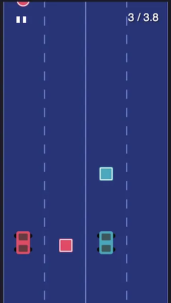

# 2Cars Game

A retro-style racing game where the player controls two cars simultaneously. Built with Svelte. This game weighs under 20kb, is highly portable (single-file), and runs on any device with a modern web browser.

[Play the demo](https://bpk-endless.s3.amazonaws.com/2Cars.html)



## How to Play

- Control two cars simultaneously
- Left car: Press 'S' key or tap left side of screen
- Right car: Press 'K' key or tap right side of screen
- Collect circles for points
- Avoid squares
- Press 'P' to pause

## Technical Overview

- **SVG-Based Rendering**: Uses SVG for declarative rendering that automatically scales. All game objects (cars, obstacles, lanes) are SVG primitives composed together.

- **Reactive Game State**: Built with Svelte's reactivity to automatically update visual elements when game state changes. Car positions, obstacle locations, and scrolling road effects are all driven by reactive statements.

- **Game Loop Architecture**: Uses requestAnimationFrame for the main game loop to handle physics, collision detection, scoring, and obstacle spawning. The loop updates game state which triggers reactive UI updates.

- **Cross-Platform Controls**: Playable via both keyboard and touch controls, with transparent touch zones overlaying each side of the screen for mobile play.

## Development

### Installation

```bash
npm install
npm run dev
npm run build  # produces a single-file HTML of the game
```
